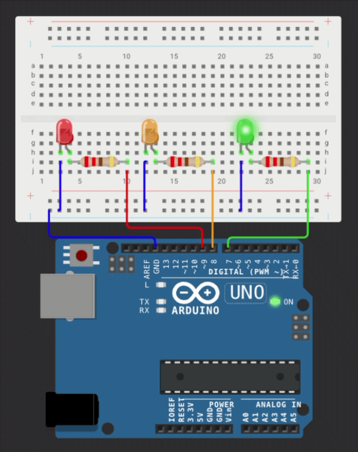

# Arduino Traffic Light (WOKWI)

A simplified traffic light simulation running on Arduino.

## Components

- Arduino Uno
- Half Breadboard
- Resistor 220Ω (3)
- LED (3)

## Features

- Simulates a traffic light using three LEDs
- Automatic light sequence (green → orange → red)

## Test

Test the project on Wokwi:
https://wokwi.com/projects/457862810873351169
